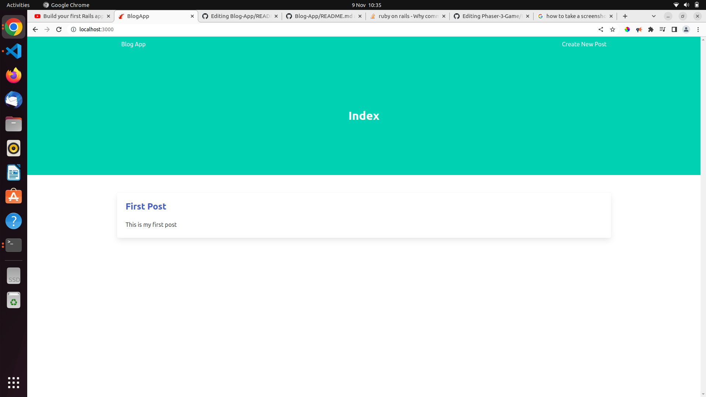

# Private Event

>This project is a Ruby on Rails project. The goal of this project is to build a basic blog app. 

### Blog App Screenshot:



# Getting Started

You should have Ruby & Ruby on Rails already installed on your machine before you begin.

To get a local copy of the repository please run the following commands on your terminal:

```
$ cd <folder>
```

```
$ git clone git@github.com:jacobrees/Blog-App.git
```

To install all of the ruby dependencies run the command `bundle install`

```
$ bundle install
```

To migrate the database run 'rails db:migrate' you will have to do this in order to do the next steps.

```
$ rails db:migrate
```

To launch the rails server inside of your terminal you will need to navigate into the repository you have just cloned. You will do this by using `cd` inside of your terminal. Once you are inside of this folder run the command `rails server` and this start the webrick server. 

Below shows the following commands you will need to run to achieve this:

```
$ cd Blog-App
```

```
$ rails server
```

Next you will want to open up your browser and navigate to the root of the application inside of your browser `https://localhost:3000` from here you can play with and experience the application fully.
```
$ https://localhost:3000
```


## Built With

- Ruby (Version - 3.1.2)
- Ruby on Rails 7.0.4


## Authors

👤 **Jacob Rees**

- Github: [@jacobrees](https://github.com/jacobrees)
- Linkedin: [jacob-rees-a6507b1a6](https://www.linkedin.com/in/jacob-rees/)


## 🤝 Contributing

Contributions, issues and feature requests are welcome!

## Show your support

Give a ⭐️ if you like this project!

## Acknowledgments

- Project inspired by The Odin Project
